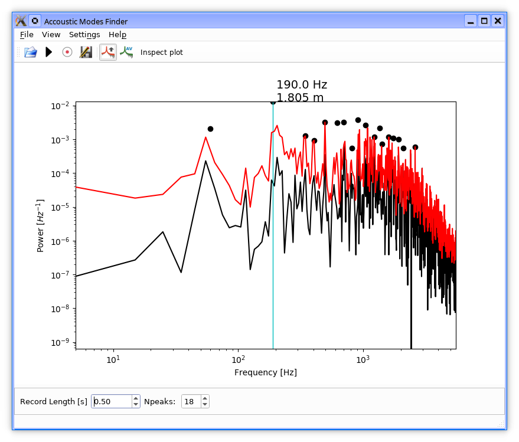

# ACOustic MODes Viewer

This program is a simple viewer of power spectral density of sound. 
The package provides a module and a program to trace Fourier acoustic modes and resonance frequencies of excited bodies.

## Use cases
For example you can:
* estimate length of an excited metal bar, guitar string, or 
* measure frequency of flute tones, 
* identify resonance frequencies and through provided sound wave propagation velocity the corresponding length scales of mechanical components that generate unwanted resonances (e.g. in a car as a function of speed)
* test 1/f noise and microphonic effects in electrical devices the program runs on.

## Installation
`pip install --index-url=https://test-pypi.org/simple acomod`

## Screenshots

Format: 
